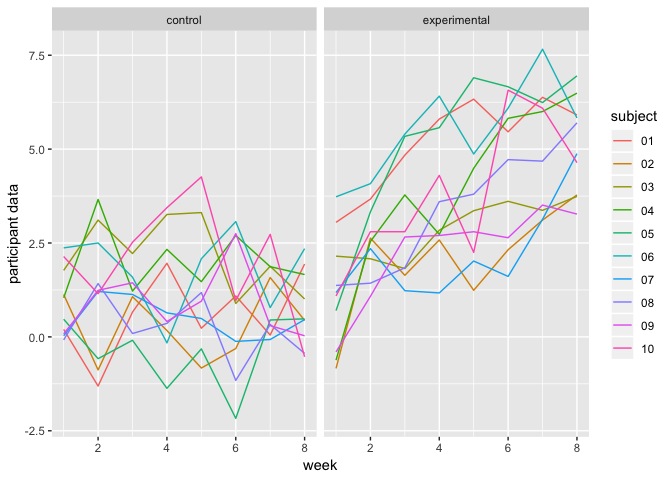
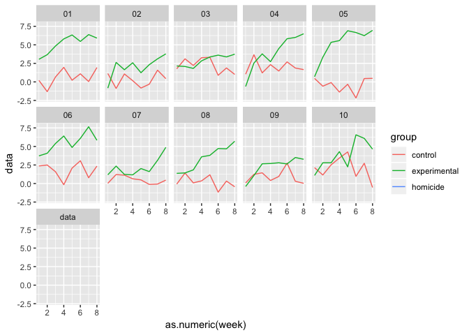

p8105\_hw5\_jx2371
================
Jingyu Xu
2018/11/4

Problem1
========

read and clean the data
-----------------------

First of all, a code chunck is used to create a dataframe containing all file names

``` r
library(tidyverse)
df = list.files(path = "./data")
```

Then, a code chunk is written to read the data in all the files and collected them in one dataset. A seires cleaning is made to the dataset.

``` r
read_data = function(x){read_csv(file = str_c("./data/", x))%>%
    mutate(group_name=x)}
tidy_data = map(df, read_data)%>%
  bind_rows()%>%
  janitor::clean_names()%>%
  select(group_name, everything())%>%
  separate(group_name, into = c("group","subject"))%>%
  mutate(group = str_replace(group,"con","control"))%>%
  mutate(group = str_replace(group,"exp", "experimental"))%>%
  gather(key = week, value = data, week_1:week_8)%>%
  mutate(week = str_replace(week, "week_", ""))
```

Draw a spaghetti plot
---------------------

Now, we use ggplot to draw a spagetti plot

``` r
ggplot(tidy_data, aes(x = as.numeric(week), y = data, color = subject))+
  geom_line()+
  labs(x = "week", 
         y = "participant data")+
  facet_grid(.~group)
```



``` r
ggplot(tidy_data, aes(x = as.numeric(week), y = data, color = group))+
         geom_line()+
         facet_wrap(.~subject, ncol = 5)
```


