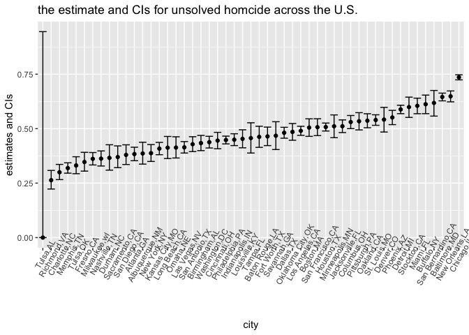

p8105\_hw5\_jx2371
================
Jingyu Xu
2018/11/4

Problem1
========

read and clean the data
-----------------------

First of all, a code chunck is used to create a dataframe containing all file names

``` r
library(tidyverse)
df = list.files(path = "./data1")
```

Then, a code chunk is written to read the data in all the files and collected them in one dataset. A seires cleaning is made to the dataset.

``` r
read_data = function(x){read_csv(file = str_c("./data1/", x))%>%
    mutate(group_name=x)}
tidy_data = map(df, read_data)%>%
  bind_rows()%>%
  janitor::clean_names()%>%
  select(group_name, everything())%>%
  separate(group_name, into = c("group","subject"))%>%
  mutate(group = str_replace(group,"con","control"))%>%
  mutate(group = str_replace(group,"exp", "experimental"))%>%
  gather(key = week, value = data, week_1:week_8)%>%
  mutate(week = str_replace(week, "week_", ""))
```

Draw a spaghetti plot
---------------------

Now, we use ggplot to draw a spagetti plot

``` r
ggplot(tidy_data, aes(x = as.numeric(week), y = data, color = subject))+
  geom_line()+
  labs(x = "week", 
         y = "participant data")+
  facet_grid(.~group)
```


Prolbem 2
=========

import the data and describe the raw data
-----------------------------------------

``` r
homcide = read.csv(file = "./data2/homicide-data.csv")
```

manipulate the data
-------------------

1.Create a city\_state variable (e.g. “Baltimore, MD”) and then summarize within cities to obtain the total number of homicides and the number of unsolved homicides (those for which the disposition is “Closed without arrest” or “Open/No arrest”).

``` r
homcide_new=homcide%>%
  mutate(city_state = str_c(city, ",", state))
```

``` r
df_1 = homcide_new%>%
  group_by(city_state)%>%
  summarize(total_number = n())

df_2 = homcide_new%>%
  filter(disposition %in% c("Closed without arrest", "Open/No arrest"))%>%
  group_by(city_state)%>%
  summarize(unsolved_number = n())

homcide_by_city = left_join(df_1, df_2, by = "city_state")
homcide_by_city[is.na(homcide_by_city)] = 0
knitr::kable(homcide_by_city)
```

| city\_state       |  total\_number|  unsolved\_number|
|:------------------|--------------:|-----------------:|
| Albuquerque,NM    |            378|               146|
| Atlanta,GA        |            973|               373|
| Baltimore,MD      |           2827|              1825|
| Baton Rouge,LA    |            424|               196|
| Birmingham,AL     |            800|               347|
| Boston,MA         |            614|               310|
| Buffalo,NY        |            521|               319|
| Charlotte,NC      |            687|               206|
| Chicago,IL        |           5535|              4073|
| Cincinnati,OH     |            694|               309|
| Columbus,OH       |           1084|               575|
| Dallas,TX         |           1567|               754|
| Denver,CO         |            312|               169|
| Detroit,MI        |           2519|              1482|
| Durham,NC         |            276|               101|
| Fort Worth,TX     |            549|               255|
| Fresno,CA         |            487|               169|
| Houston,TX        |           2942|              1493|
| Indianapolis,IN   |           1322|               594|
| Jacksonville,FL   |           1168|               597|
| Kansas City,MO    |           1190|               486|
| Las Vegas,NV      |           1381|               572|
| Long Beach,CA     |            378|               156|
| Los Angeles,CA    |           2257|              1106|
| Louisville,KY     |            576|               261|
| Memphis,TN        |           1514|               483|
| Miami,FL          |            744|               450|
| Milwaukee,wI      |           1115|               403|
| Minneapolis,MN    |            366|               187|
| Nashville,TN      |            767|               278|
| New Orleans,LA    |           1434|               930|
| New York,NY       |            627|               243|
| Oakland,CA        |            947|               508|
| Oklahoma City,OK  |            672|               326|
| Omaha,NE          |            409|               169|
| Philadelphia,PA   |           3037|              1360|
| Phoenix,AZ        |            914|               504|
| Pittsburgh,PA     |            631|               337|
| Richmond,VA       |            429|               113|
| Sacramento,CA     |            376|               139|
| San Antonio,TX    |            833|               357|
| San Bernardino,CA |            275|               170|
| San Diego,CA      |            461|               175|
| San Francisco,CA  |            663|               336|
| Savannah,GA       |            246|               115|
| St. Louis,MO      |           1677|               905|
| Stockton,CA       |            444|               266|
| Tampa,FL          |            208|                95|
| Tulsa,AL          |              1|                 0|
| Tulsa,OK          |            583|               193|
| Washington,DC     |           1345|               589|

2.For the city of Baltimore, MD, use the prop.test function to estimate the proportion of homicides that are unsolved; save the output of prop.test as an R object, apply the broom::tidy to this object and pull the estimated proportion and confidence intervals from the resulting tidy dataframe

``` r
#caculate the total homecide number of Baltimore
total = homcide_by_city%>%
  filter(city_state %in% "Baltimore,MD")%>%
  select(total_number, unsolved_number)%>%
  .$total_number
#caculate the unsolved homecide number of Baltimore
unsolved = homcide_by_city%>%
  filter(city_state %in% "Baltimore,MD")%>%
  select(total_number, unsolved_number)%>%
  .$unsolved_number
#use prop.test and pull out the estimated proportion and confidence intervals
Baltimore_estimate = prop.test(unsolved, total)%>%
  broom::tidy()
```

The estimate proportion of Baltimore,MD is 0.6455607. The confidence intervals of Baltimore, MD is (0.6275625,0.6631599)

3.run prop.test for each of the cities in your dataset, and extract both the proportion of unsolved homicides and the confidence interval for each. Do this within a “tidy” pipeline, making use of purrr::map, purrr::map2, list columns and unnest as necessary to create a tidy dataframe with estimated proportions and CIs for each city

``` r
clean_data = function(x,n){prop.test(x, n)%>%
    broom::tidy()}
estimate_tidy = map2(.x = homcide_by_city$unsolved_number, .y = homcide_by_city$total_number, ~clean_data(x =.x, n = .y))%>%
  bind_rows()%>%
  bind_cols(homcide_by_city,.)%>%
  select(city_state,estimate,conf.low,conf.high)
estimate_tidy
```

    ## # A tibble: 51 x 4
    ##    city_state     estimate conf.low conf.high
    ##    <chr>             <dbl>    <dbl>     <dbl>
    ##  1 Albuquerque,NM    0.386    0.337     0.438
    ##  2 Atlanta,GA        0.383    0.353     0.415
    ##  3 Baltimore,MD      0.646    0.628     0.663
    ##  4 Baton Rouge,LA    0.462    0.414     0.511
    ##  5 Birmingham,AL     0.434    0.399     0.469
    ##  6 Boston,MA         0.505    0.465     0.545
    ##  7 Buffalo,NY        0.612    0.569     0.654
    ##  8 Charlotte,NC      0.300    0.266     0.336
    ##  9 Chicago,IL        0.736    0.724     0.747
    ## 10 Cincinnati,OH     0.445    0.408     0.483
    ## # ... with 41 more rows

4、Create a plot that shows the estimates and CIs for each city – check out geom\_errorbar for a way to add error bars based on the upper and lower limits. Organize cities according to the proportion of unsolved homicides

``` r
estimate_tidy%>%
            mutate(city_state = fct_reorder(city_state, estimate))%>%
            ggplot(aes(x = city_state, y = estimate,))+
            geom_point()+
            geom_errorbar(aes(ymin = conf.low, ymax= conf.high))+
            theme(axis.text.x =  element_text(angle = 60))+
            labs(
              title = "the estimate and CIs for unsolved homcide across the U.S.",
              x = "city",
              y = "estimates and CIs"
            )
```


