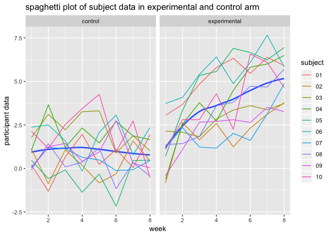

p8105\_hw5\_jx2371
================
Jingyu Xu
2018/11/4

Problem1
========

read and clean the data
-----------------------

First of all, a code chunck is used to create a dataframe containing all file names

``` r
library(tidyverse)
df = list.files(path = "./data1")
```

Then, a code chunk is written to read the data in all the files and collected them in one dataset. A seires cleaning is made to the dataset.

``` r
read_data = function(x){read_csv(file = str_c("./data1/", x))%>%
    mutate(group_name=x)}
tidy_data = map(df, read_data)%>%
  bind_rows()%>%
  janitor::clean_names()%>%
  select(group_name, everything())%>%
  separate(group_name, into = c("group","subject"))%>%
  mutate(group = str_replace(group,"con","control"))%>%
  mutate(group = str_replace(group,"exp", "experimental"))%>%
  gather(key = week, value = data, week_1:week_8)%>%
  mutate(week = str_replace(week, "week_", ""))
```

Draw a spaghetti plot
---------------------

Now, we use ggplot to draw a spagetti plot

``` r
ggplot(tidy_data, aes(x = as.numeric(week), y = data, color = subject))+
  geom_line()+
  labs(x = "week", 
         y = "participant data")+
  facet_grid(.~group)
```



``` r
ggplot(tidy_data, aes(x = as.numeric(week), y = data, color = group))+
         geom_line()+
         facet_wrap(.~subject, ncol = 5)
```


Prolbem 2
=========

import the data and describe the raw data
-----------------------------------------

``` r
homcide = read.csv(file = "./data2/homicide-data.csv")
```

manipulate the data
-------------------

1.Create a city\_state variable (e.g. “Baltimore, MD”) and then summarize within cities to obtain the total number of homicides and the number of unsolved homicides (those for which the disposition is “Closed without arrest” or “Open/No arrest”).

``` r
homcide_new=homcide%>%
  mutate(city_state = str_c(city, ",", state))
```

``` r
df_1 = homcide_new%>%
  group_by(city_state)%>%
  summarize(total_number = n())

df_2 = homcide_new%>%
  filter(disposition %in% c("Closed without arrest", "Open/No arrest"))%>%
  group_by(city_state)%>%
  summarize(unsolved_number = n())

homcide_by_city = left_join(df_1, df_2, by = "city_state")
homcide_by_city[is.na(homcide_by_city)] = 0
homcide_by_city
```

    ## # A tibble: 51 x 3
    ##    city_state     total_number unsolved_number
    ##    <chr>                 <int>           <dbl>
    ##  1 Albuquerque,NM          378             146
    ##  2 Atlanta,GA              973             373
    ##  3 Baltimore,MD           2827            1825
    ##  4 Baton Rouge,LA          424             196
    ##  5 Birmingham,AL           800             347
    ##  6 Boston,MA               614             310
    ##  7 Buffalo,NY              521             319
    ##  8 Charlotte,NC            687             206
    ##  9 Chicago,IL             5535            4073
    ## 10 Cincinnati,OH           694             309
    ## # ... with 41 more rows
